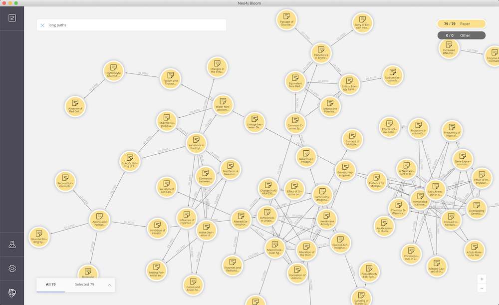

== Nature Papers in Neo4j

=== Source

Tonight I came across this https://www.youtube.com/watch?v=GW4s58u8PZo[impressively narrated video] of a colorful co-cited graph of papers since the late 1800s.

ifndef::env-github[]
.Narrated Youtube video
++++
<iframe width="560" height="315" src="https://www.youtube.com/embed/GW4s58u8PZo" frameborder="0" allow="accelerometer; autoplay; encrypted-media; gyroscope; picture-in-picture" allowfullscreen></iframe>
++++
endif::[]

ifdef::env-github[]
image::./nature-papers-video.png[link="https://www.youtube.com/embed/GW4s58u8PZo"]
endif::[]

You can read more about this in the https://www.nature.com/collections/eidahgdici/[Essay series] and thankfully Nature has also made the visualization available to https://www.nature.com/immersive/d41586-019-03165-4/index.html[explore interactively] for everyone.

ifndef::env-github[]
++++
<iframe src="https://www.nature.com/immersive/d41586-019-03165-4/index.html" width="800" height="600"></iframe>
++++
endif::[]

And there is also a https://www.nature.com/immersive/d41586-019-03165-4/dat/data.zip[Download Link for the data], which is a zip-file with two CSVs (nodes and edges).

=== Import

So we can import the co-cited paper data into Neo4j and can have some fun with it.

====
If you haven't you can either:

1. download https://neo4j.com/download[Neo4j Desktop]
2. create a new "Local Graph" in your default project
3. start it
4. then open Neo4j Browser
====

Unzip the data file and copy the two CSV files to your Neo4j import folder
E.g. via the drop-down button in Neo4j Desktop -> Manage Graph.

====
Or you can use a blank https://neo4j.com/sandbox[Neo4j Sandbox]. 
If you use the Bloom sandbox you can also visualize larger parts of the graph.

If you are online and have APOC installed (which Sandbox has), you can use the original zip file directly, by just appending the CSV file to the URL.

just replace the LOAD CSV line with: 

`call apoc.load.csv("https://www.nature.com/immersive/d41586-019-03165-4/dat/data.zip!cociteNodes.csv") yield map as row`
====

.cociteNodes.csv
,===
x,y,size,PubYear,HierCat,NatureID,Title
-1247,1345,5.3,1900,1,062366b0,Atmospheric Electricity
,===

WARNING: There are duplicates in the data, so need to use unique constraint and `MERGE`.

.Costraint for Paper-Ids
[source,cypher]
----
create constraint on (p:Paper) assert p.id is unique;
----

.Load Nodes
[source,cypher]
----
load csv with headers from "file:///cociteNodes.csv" as row
merge (p:Paper {id:row.NatureID})
SET p += {title:row.Title, x:toInteger(row.x), y:toInteger(row.y), size:toFloat(row.size), year:toInteger(row.PubYear), category:toInteger(row.HierCat)};
// Added 88231 labels, created 88231 nodes, set 529641 properties, completed after 2743 ms.
----

.cociteEdges.csv
,===
source,target,path
207249a0,200413a0,-1834.0;529.0;66.0|-1663.6;555.5,....
,===

.Load Relationships
[source,cypher]
----
load csv with headers from "file:///cociteEdges.csv" as row
match (p1:Paper {id:row.source}),(p2:Paper {id:row.target})
merge (p1)-[:CO_CITED]->(p2);
// not storing that path for now
// Created 239621 relationships, completed after 7275 ms.
----

It looks like this:

=== Quick Analysis

.Most represented years
----
match (p:Paper) 
return p.year, count(*) as count 
order by count desc limit 5

╒════════╤═══════╕
│"p.year"│"count"│
╞════════╪═══════╡
│1966    │2620   │
├────────┼───────┤
│1963    │2587   │
├────────┼───────┤
│1964    │2568   │
├────────┼───────┤
│1967    │2518   │
├────────┼───────┤
│1965    │2425   │
└────────┴───────┘
----

It seems as if the 60s are overproportionally represented, which is odd.

.Paper citing other papers
----
MATCH (p:Paper)
WITH size((p)-->()) as out
RETURN min(out), max(out), avg(out), 
percentileDisc(out,0.5) as p50, percentileDisc(out,0.75) as p75 , 
percentileDisc(out,0.9) as p90, percentileDisc(out,0.99) as p99;

╒══════════╤══════════╤═══════════╤═════╤═════╤═════╤═════╕
│"min(out)"│"max(out)"│"avg(out)" │"p50"│"p75"│"p90"│"p99"│
╞══════════╪══════════╪═══════════╪═════╪═════╪═════╪═════╡
│0         │77        │2.71583683 │2    │4    │6    │17   │
└──────────┴──────────┴───────────┴─────┴─────┴─────┴─────┘
----

==== Most cited papers

----
MATCH (p:Paper)
RETURN p.title, p.year, size((p)<--()) as citations
ORDER BY citations DESC LIMIT 5;

╒══════════════════════════════════════════════════════════════════════╤════════╤═══════════╕
│"p.title"                                                             │"p.year"│"citations"│
╞══════════════════════════════════════════════════════════════════════╪════════╪═══════════╡
│"Induced Radioactivity of Fluorine and Calcium"                       │1935    │78         │
├──────────────────────────────────────────────────────────────────────┼────────┼───────────┤
│"Radioactivity of Samarium"                                           │1946    │74         │
├──────────────────────────────────────────────────────────────────────┼────────┼───────────┤
│"Passage of Helium through Compact Solids"                            │1935    │70         │
├──────────────────────────────────────────────────────────────────────┼────────┼───────────┤
│"Convection and the Constant Q-Mechanism"                             │1971    │70         │
├──────────────────────────────────────────────────────────────────────┼────────┼───────────┤
│"Immunological Investigation of a Christmas Factor Inhibitor by Means │1962    │69         │
│of Boyden's Technique"                                                │        │           │
└──────────────────────────────────────────────────────────────────────┴────────┴───────────┘
----

==== Examine the network fo the most cited paper of the last 20 years

[source,cypher]
----
MATCH (p:Paper) WHERE p.year > date().year - 20
WITH p 
ORDER BY size((p)<--()) DESC LIMIT 1
MATCH path = ()-->(p)-->()
RETURN path;
----

==== Top Keywords of Categories

A bit of an apoc monster for the text processing: 

`- tolower -> split -> collect -> flatten -> frequencies -> sort -> item`

[source,cypher]
----
match (p:Paper)
return p.category, [m IN apoc.coll.sortMaps(apoc.coll.frequencies(apoc.coll.flatten(collect([x in split(toLower(p.title)," ") where length(x)> 4]))),"count")|m.item][0..10] as words
----

,===
p.category,words
1,"[effect,plant,growth,plants,development,between,cells,drosophila,effects,control]"
10,"[quantum,magnetic,electron,cosmic,structure,effect,light,optical,nuclear,observation]"
4,"[cells,human,effect,activity,receptor,mouse,brain,growth,virus,vitro]"
13,"[hominid,early,human,pleistocene,fossil,evidence,olduvai,dating,kenya,africa]"
6,"[structure,effect,carbon,formation,fibres,metals,radio,crystals,effects,surface]"
2,"[human,cells,protein,structure,effect,virus,activity,synthesis,between,muscle]"
3,"[structure,chromatography,water,synthesis,molecular,crystal,hydrogen,effect,compounds,electron]"
9,"[effect,statistical,tables,population,random,density,theory,relation,rainfall,spectrum]"
8,"[origin,inductive,probability,effect,zealand,impossibility,south,structure,between,theory]"
5,"[evidence,radio,solar,mantle,ocean,origin,x-ray,during,observations,magnetic]"
12,"[visual,effect,behaviour,human,memory,effects,between,perception,learning,discrimination]"
11,"[science,impact,velocity,research,method,liquid,action,theory,growth,between]"
7,"[ageing,virus,human,effect,anopheles,gambiae,plasmodium,influenza,between,synthesis]"
0,"[nature,theory,effect,structure,infection,polysaccharides,stromatoporoids,reproduction,spawning-places,fresh-water]"
,===

== TODO

- clusters / louvain
- bloom 1.2
- degree distribution

=== Visualization 

=== Bloom

If you are usinge the Neo4j sandbox you can use an query like "Paper Paper Paper" to denote a 3 hop pattern.

Here is one with up to 20 hops done with a Cypher statement (Search Phrase).

=== 3d Force Graph

A bit closer to the Nature representation is the https://github.com/neo4j-3d-force-graph[3d-force-graph] variant.

You can find the code in link:nature.html[]

.Co-cited Papers from 1960

.Run the visualization
----
python -m SimpleHTTPServer &
open http://localhost:8000/nature.html
----

// TODO with aura URL https://raw.githack.com/neo4j-examples/neo4j-graph-datasets/master/nature-cocited-papers/nature.html

=== Graph Analysis

Quickly running Louvain to identify clusters. As we already have a mono-partite graph (one type of node and relationships) we need no arguments.

I't pretty quick too.

----
call algo.louvain()

╒════════════╤═══════════════╤═══════╤════════════════╤═════╤═════╤═════╤═════╤═════╤══════╕
│"loadMillis"│"computeMillis"│"nodes"│"communityCount"│"p50"│"p75"│"p90"│"p95"│"p99"│"p100"│
╞════════════╪═══════════════╪═══════╪════════════════╪═════╪═════╪═════╪═════╪═════╪══════╡
│101         │1924           │88231  │783             │1    │1    │357  │787  │1809 │2891  │
└────────────┴───────────────┴───────┴────────────────┴─────┴─────┴─────┴─────┴─────┴──────┘
----

So we have 783 communities with at most 2900 members.

Let's look at one of the smaller community and see if the grouping of titles make sense.

[source,cypher]
----
MATCH (p:Paper)
WITH p.community as c, collect(p) as papers
WHERE  50 < size(papers) < 100
WITH papers LIMIT 1
UNWIND papers as p
RETURN p.title as title
----

Looks in this case like genetics around viruses and immunology.

,===
title
Particles associated with Australia Antigen in the Sera of Patients with Leukaemia&#44; Down's Syndrome and Hepatitis
Menstrual Function and Pregnancy in Narcotics Addicts treated with Methadone
Australia Antigen detected in the Nuclei of Liver Cells of Patients with Viral Hepatitis by the Fluorescent Antibody Technique
Persistence of the Serum Hepatitis (SH-Australia) Antigen for Many Years
Viral Hepatitis and the Australia-SH Antigen
Additional Specificities of Australia Antigen and the Possible Identification of Hepatitis Carriers
Chimpanzee Antibodies to Australia Antigen
Australia Antigen&#8212;Antibody Complexes
Failure to detect an Antigen associated with Hepatitis in a Community Epidemic
Membrane-complement Fixation Test for Hepatitis Associated Antigen
Teratogenicity Studies of Methadone HCl in Rats and Rabbits
Experimental Infection of Chimpanzees with the Virus of Hepatitis B
Australia Antigen as a Marker of Propagation of the Serum Hepatitis Virus in Liver Cultures
Evidence for a Tumour-associated Antigen in Human Malignant Melanoma
Specific Neutralization of Human Hepatitis Type A in Marmoset Monkeys
,===

Let's quickly (1-2 seconds) run pagerank over the graph and then use the most influential paper to stand in for each cluster.

----
CALL algo.pageRank()
----

What are the highest ranked papers overall?

[source,cypher]
----
MATCH (p:Paper)
RETURN p.title, p.pagerank 
ORDER BY p.pagerank DESC LIMIT 5

╒══════════════════════════════════════════════════════════════════════════════════════════════════════════════╤══════════════════╕
│"p.title"                                                                                                     │"p.pagerank"      │
╞══════════════════════════════════════════════════════════════════════════════════════════════════════════════╪══════════════════╡
│"Bradykinin Activity of some Synthetic Peptides with only Slight Structural Resemblance to Natural Bradykinin"│11.033146028417251│
├──────────────────────────────────────────────────────────────────────────────────────────────────────────────┼──────────────────┤
│"Effect of Heat on the Serum Factors Gma&#44; Gmb&#44; Gmx and Gm-like"                                       │10.15241200541213 │
├──────────────────────────────────────────────────────────────────────────────────────────────────────────────┼──────────────────┤
│"Immunological Investigation of a Christmas Factor Inhibitor by Means of Boyden's Technique"                  │10.104345292859408│
├──────────────────────────────────────────────────────────────────────────────────────────────────────────────┼──────────────────┤
│"Evidence for the Natural Radioactivity of Indium"                                                            │9.737915850857796 │
├──────────────────────────────────────────────────────────────────────────────────────────────────────────────┼──────────────────┤
│"Observation of Million Degree Thermal Radiation from the Sun at a Wavelength of 1.5 Metres"                  │8.656841534959627 │
└──────────────────────────────────────────────────────────────────────────────────────────────────────────────┴──────────────────┘
----

=== Grouping

We can now use APOC grouping to create a virtual graph that represents the clustered graph.
By grouping it by community then all crossing relationships are merged together too into virtual ones.

There is a slight trick we have to use for Browser and Bloom to properly render the nodes and rels.

----
call apoc.nodes.group(["Paper"],["community"]) yield nodes, relationships
where size(relationships) > 1
unwind nodes as node
unwind relationships as rel
return node, rel
----

=== Credits

* Design: Alice Grishchenko, Mauro Martino
* Data Analysis: Alexander Gates, Qing Ke, Onur Varol, Albert-László Barabási
* Special thanks: Kelly Krause & the Nature team

(c) BarabasiLab 2019
